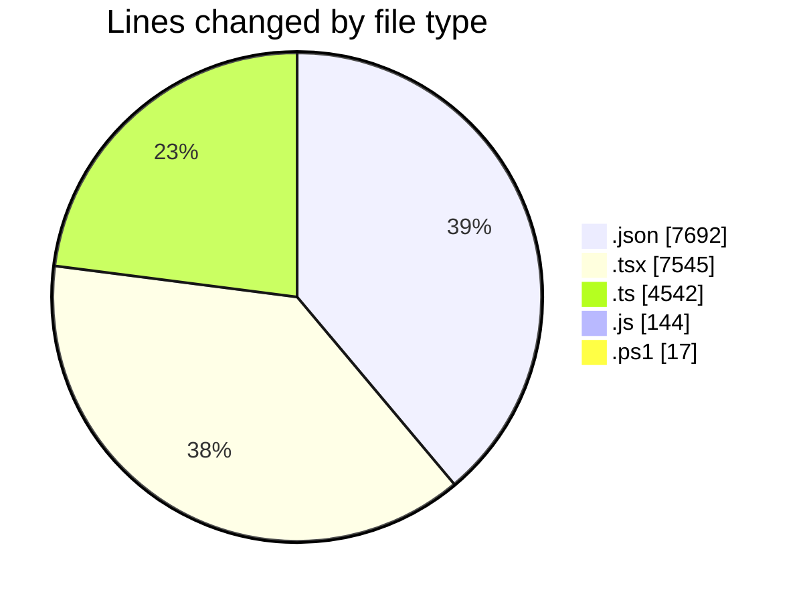
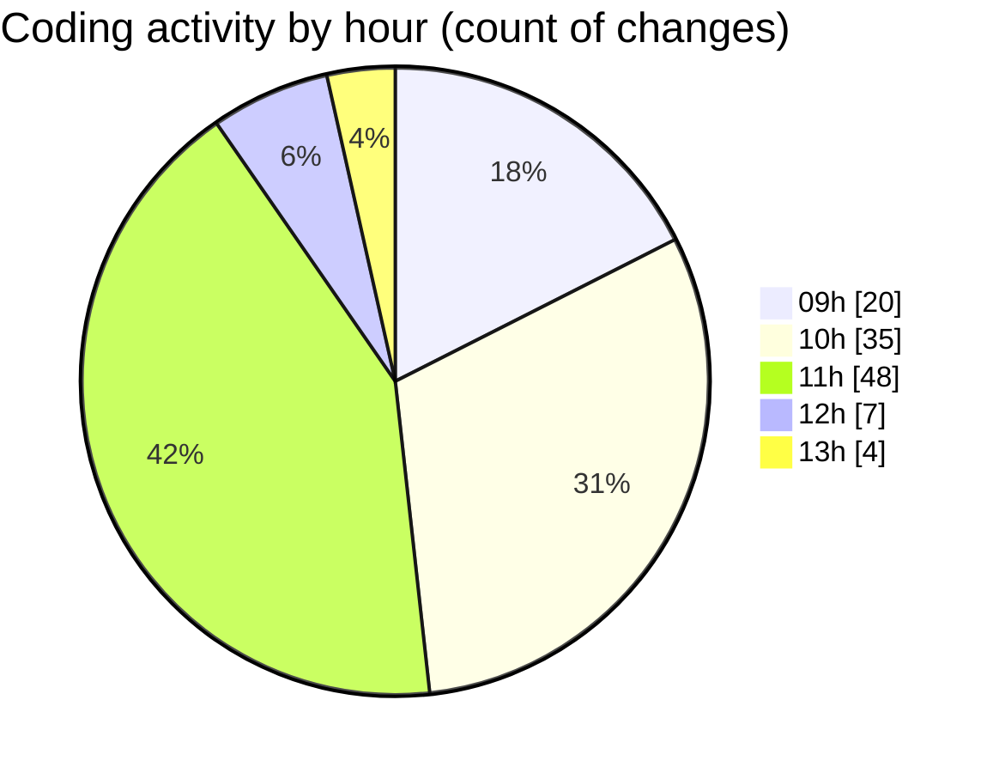

# ecodeli-1 - Activity Summary 

## Overall Statistics

| Stat                   | Value                                                             |
| ---------------------- | ----------------------------------------------------------------- |
| **Lines Added** (➕)   | 19810                                          |
| **Lines Removed** (➖) | 130                                        |
| **Net Change** (↕)    | 19680                |
| **Active Time** (⌚)   | 146 minutes |

## Modified Files
- **package.json** (+1, -0)
- **page.tsx** (+468, -22)
- **use-admin-clients.ts** (+162, -0)
- **page.tsx** (+284, -0)
- **page.tsx** (+510, -0)
- **page.tsx** (+528, -0)
- **settings.json** (+42, -0)
- **fr.json** (+7649, -0)
- **pending-user-verifications.tsx** (+239, -0)
- **page.tsx** (+59, -27)
- **user-documents-list.tsx** (+457, -2)
- **page.tsx** (+55, -35)
- **page.tsx** (+184, -0)
- **deliverer-deliveries.router.ts** (+1176, -0)
- **delivery.schema.ts** (+213, -0)
- **delivery-monitoring.tsx** (+187, -0)
- **announcement.router.ts** (+1028, -0)
- **test-translations.js** (+40, -0)
- **restart-dev.ps1** (+17, -0)
- **page.tsx** (+38, -10)
- **announcement-dashboard.tsx** (+200, -4)
- **announcement-table.tsx** (+524, -4)
- **debug-translations.js** (+104, -0)
- **page.tsx** (+393, -0)
- **page.tsx** (+535, -0)
- **page.tsx** (+511, -0)
- **page.tsx** (+785, -25)
- **page.tsx** (+514, -1)
- **admin-services.router.ts** (+428, -0)
- **admin.router.ts** (+23, -0)
- **admin-logs.router.ts** (+312, -0)
- **admin-settings.router.ts** (+290, -0)
- **page.tsx** (+24, -0)
- **use-admin-services.ts** (+179, -0)
- **use-service-categories.ts** (+141, -0)
- **services-stats.tsx** (+218, -0)
- **services-filters.tsx** (+260, -0)
- **services-list.tsx** (+333, -0)
- **page.tsx** (+109, -0)
- **root.ts** (+121, -0)
- **index.ts** (+17, -0)
- **use-admin-contracts.ts** (+271, -0)
- **use-contract-templates.ts** (+181, -0)

## Visualizations

### By File Type (Lines Changed)

### By Hour (Estimated Activity Count)

> **Last Updated:** 6/10/2025, 1:43:03 PM