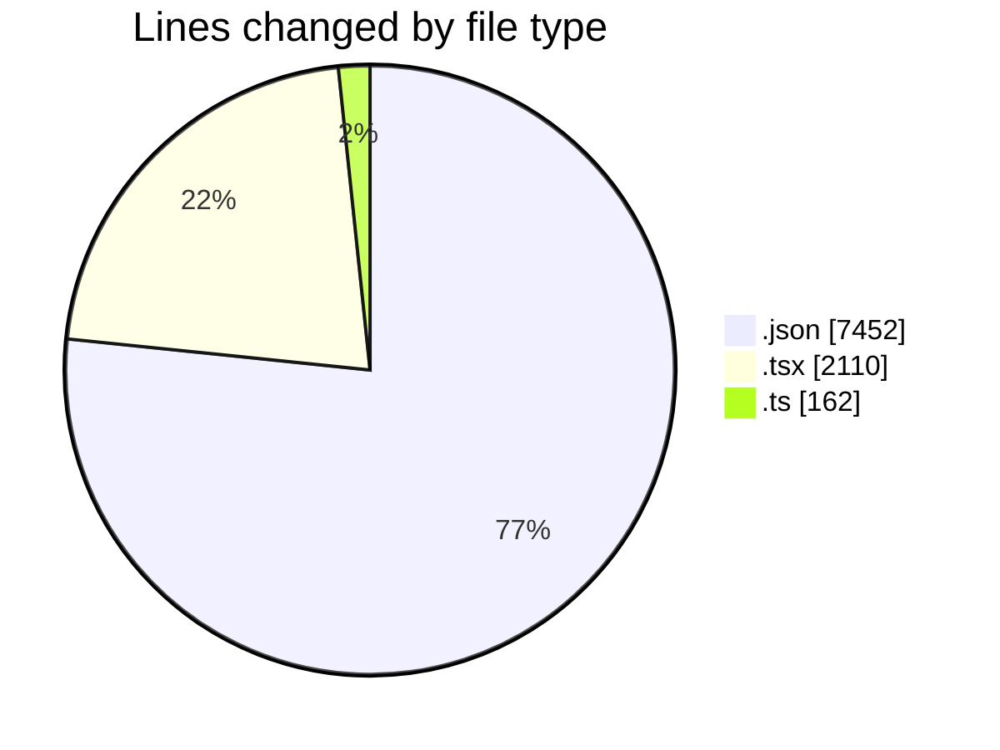
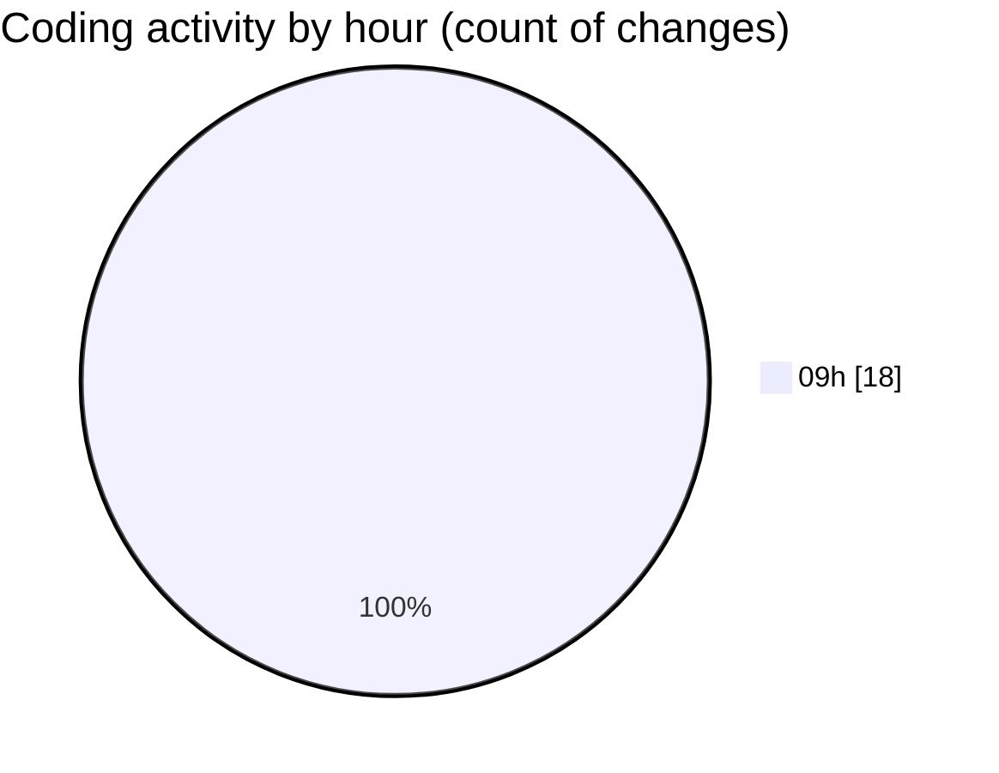

# ecodeli-1 - Activity Summary 

## Overall Statistics

| Stat                   | Value                                                             |
| ---------------------- | ----------------------------------------------------------------- |
| **Lines Added** (➕)   | 9702                                          |
| **Lines Removed** (➖) | 22                                        |
| **Net Change** (↕)    | 9680                |
| **Active Time** (⌚)   | 33 minutes |

## Modified Files
- **package.json** (+1, -0)
- **page.tsx** (+468, -22)
- **use-admin-clients.ts** (+162, -0)
- **page.tsx** (+284, -0)
- **page.tsx** (+510, -0)
- **page.tsx** (+528, -0)
- **settings.json** (+42, -0)
- **fr.json** (+7409, -0)
- **pending-user-verifications.tsx** (+239, -0)
- **page.tsx** (+59, -0)

## Visualizations

### By File Type (Lines Changed)

### By Hour (Estimated Activity Count)

> **Last Updated:** 6/10/2025, 9:57:54 AM