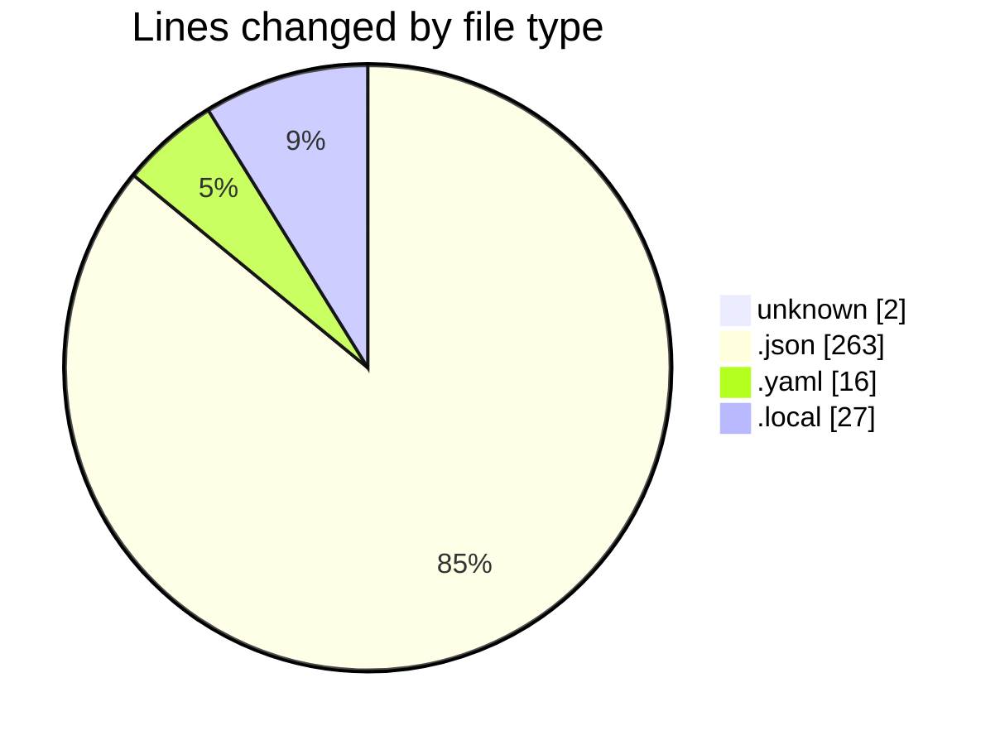
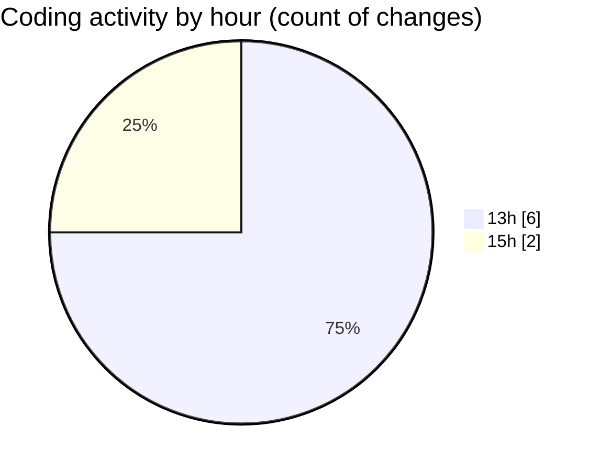

# ecodeli-1 - Activity Summary 

## Overall Statistics

| Stat                   | Value                                                             |
| ---------------------- | ----------------------------------------------------------------- |
| **Lines Added** (➕)   | 308                                          |
| **Lines Removed** (➖) | 0                                        |
| **Net Change** (↕)    | 308                |
| **Active Time** (⌚)   | 5 minutes |

## Modified Files
- **.gitignore** (+2, -0)
- **package.json** (+24, -0)
- **pnpm-workspace.yaml** (+16, -0)
- **package.json** (+239, -0)
- **.env.local** (+27, -0)

## Visualizations

### By File Type (Lines Changed)

### By Hour (Estimated Activity Count)

> **Last Updated:** 6/12/2025, 3:02:09 PM