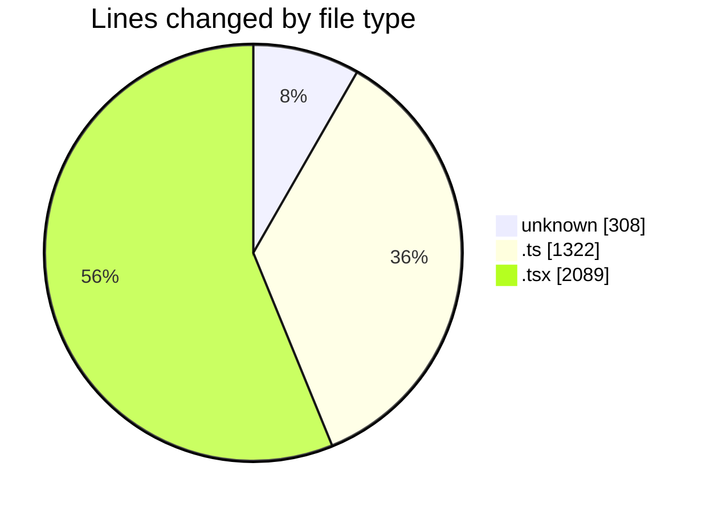
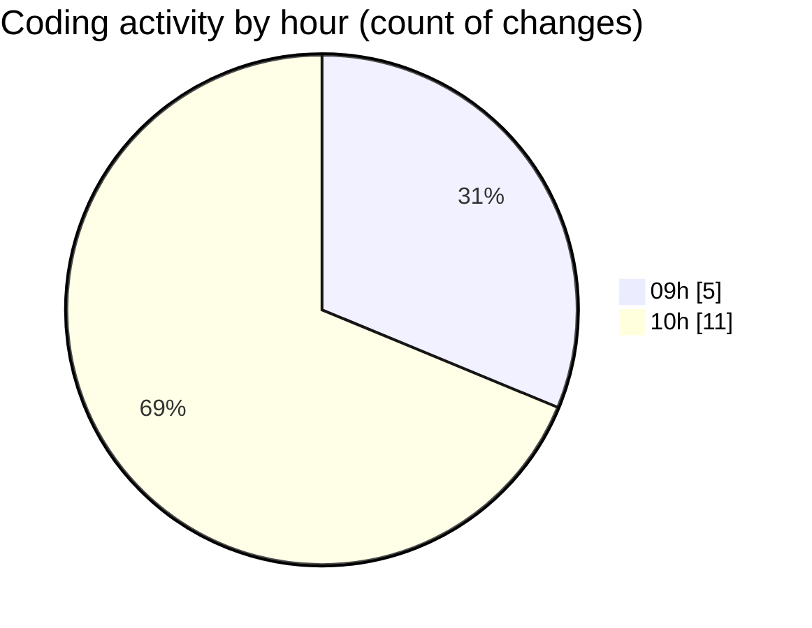

# ecodeli-1 - Activity Summary 

## Overall Statistics

| Stat                   | Value                                                             |
| ---------------------- | ----------------------------------------------------------------- |
| **Lines Added** (➕)   | 3717                                          |
| **Lines Removed** (➖) | 2                                        |
| **Net Change** (↕)    | 3715                |
| **Active Time** (⌚)   | 19 minutes |

## Modified Files
- **.gitignore** (+273, -2)
- **.env** (+33, -0)
- **multi-verification-users-seed.ts** (+660, -0)
- **admin-users-seed.ts** (+633, -0)
- **seed.ts** (+29, -0)
- **admin-dashboard.tsx** (+1091, -0)
- **report-dashboard.tsx** (+753, -0)
- **page.tsx** (+245, -0)

## Visualizations

### By File Type (Lines Changed)

### By Hour (Estimated Activity Count)

> **Last Updated:** 6/13/2025, 10:43:56 AM