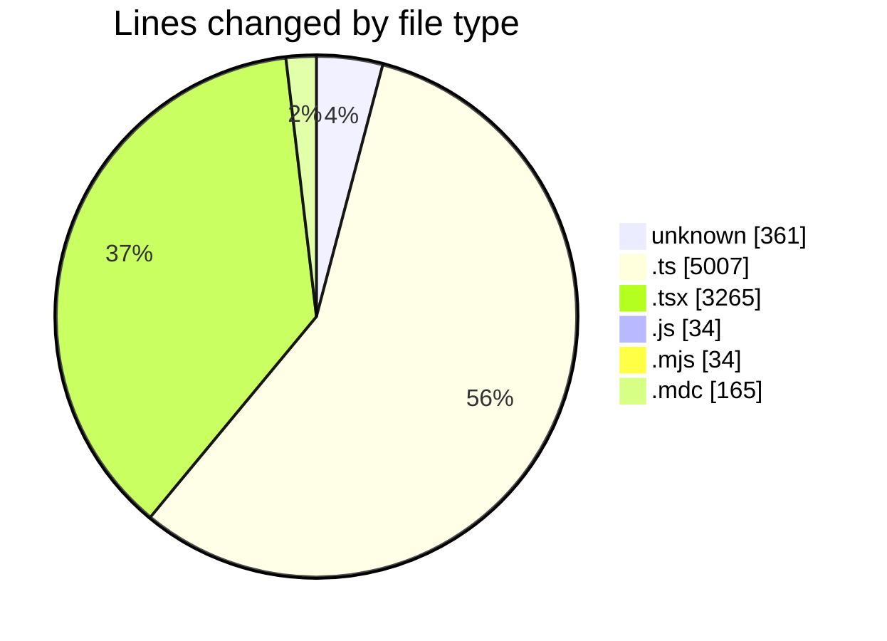
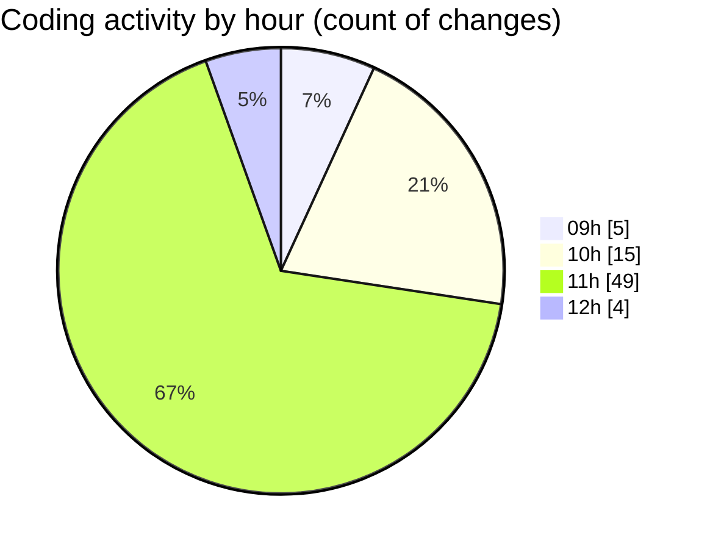

# ecodeli-1 - Activity Summary 

## Overall Statistics

| Stat                   | Value                                                             |
| ---------------------- | ----------------------------------------------------------------- |
| **Lines Added** (➕)   | 8050                                          |
| **Lines Removed** (➖) | 816                                        |
| **Net Change** (↕)    | 7234                |
| **Active Time** (⌚)   | 112 minutes |

## Modified Files
- **.gitignore** (+290, -14)
- **.env** (+49, -8)
- **multi-verification-users-seed.ts** (+1156, -485)
- **admin-users-seed.ts** (+633, -0)
- **seed.ts** (+29, -0)
- **admin-dashboard.tsx** (+1091, -0)
- **report-dashboard.tsx** (+1085, -226)
- **page.tsx** (+353, -75)
- **check-user.js** (+34, -0)
- **check-user.mjs** (+34, -0)
- **use-auth.ts** (+329, -0)
- **auth.router.ts** (+977, -8)
- **todo.mdc** (+165, -0)
- **auth.service.ts** (+1390, -0)
- **login-form.tsx** (+435, -0)

## Visualizations

### By File Type (Lines Changed)

### By Hour (Estimated Activity Count)

> **Last Updated:** 6/13/2025, 12:18:56 PM